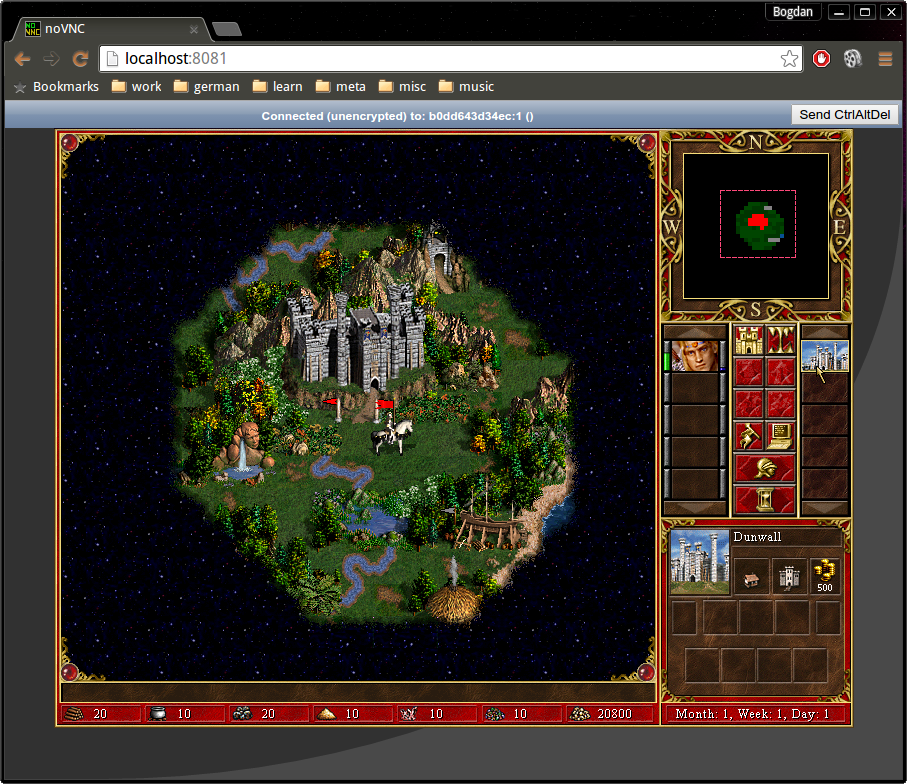

bmst/h3demo
===========

This is the Heroes3 Demo, made by 3DO, back in 1999. Available now as a docker image.
That you can play from the browser:



Running
-------

Running the game (means you agree with the [EULA](EULA)):

```shell
docker run \
    -e UID=$(id -u) \
    -e GID=$(id -g) \
    --rm \
    -p 8081:8081 \
    bmst/h3demo
```

Open a browser, point it at http://localhost:8081/

Enjoy!

Why
---

I am trying to make a point, on what it you can do with application
deployments on Docker.